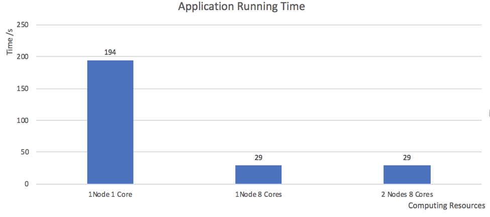

# Twitter Data Processing

## Introduction

The project is to implement an algorithm in parallel programming that processes the Twitter data in large json file (about 11GB) and find out the posts number and top 5 most common hashtags of different areas in Melbourne. `tinyTwitter.json` is a test file and small sample of the twitter json file, `melbGrid.json` is the geographic information file of different area of Melbourne.

## Usage

In the file diretory, The `*.slurm` files are the scripts which can be run on HPC system. The name of the script indicates the resource it requests, for example, `node_1_core_8.slurm`, would run with single node and 8 cores. We assume that `main.py`, `*.slurm` are in the same directory, then run with default `bigTwiiter.json` and `melbGrid.json` on HPC:
```sh
# when bigTwiiter.json and melbGrid.json file is in the same directory
sbatch node_1_core_8.slurm
```
or run with specific twitter file or grid files:
```sh
# specify twitter file and melbourn grid file
sbatch node_1_core_8.slurm <path_of_twitter_file> <path_of_grid_file>

# specify twitter file only
sbatch node_1_core_8.slurm <path_of_twitter_file>
```

## Core Algorithm
### Parallel Processing
In order to take advantage of HPC and MPI programming to process the big file, the crucial idea is divide and conquer. For example, if we have the resource of 8 cores, we can launch 8 parallel tasks(single thread), and let each task process different part of the file, and each task takes exactly 1/8 workload of the total.  
The steps to implement:
1. Obtain the total size of the `bigTwiiter.json`, for example, 8,000,000 bytes.
1. The processes in the same communicator calculate their start and stop position. Then `Process 0` takes the bytes in range of 0~1,000,000, `Process 2` takes the bytes in range of 1,000,001~2,000,000, and so on.
1. In `bigTwiiter.json`, each line is a json item, for convenient, we add an offset value to the start and stop points, so that every start point will locate at the start of a line, and the stop point will locate at the end of a line, instead of starting or stopping at in the middle of the line.
1. In python, method `file.seek()` can address to a specific position in the middle of a file with complexity of `O(1)`, therefore all processes can start process the target data at the same time. Each process reads the data from the file line by line, and extracts the target value(`text` and `coordinates`) of the json object.
1. Each process calculate the result of its own part, then the root process gathers the result from all the other processes within the communicator, it sum up the result and rank the number of hashtags and posts, and output the final result. In `mpi4py`, the method `MPI.COMM_WORLD.gather()` can collect the same variables in a list.

### Counting the numbers
Now we are able to obtain tweet data one by one. In order to count the number of posts of each cell and find the top 5 number of hashtags in each cell, we have to maintain 2 data structures to store the result in every process.
* `posts_counter`: a hash table with the cell name as the key and posts number as value, an example of `posts_counter`:  
```json
{ "A1": 98273, "A2": 40823, "D5": 9873 }
```
* `hash_counter_table`: which is a cell table of hashtag counters, and the hashtag counters are hash tables with hashtag name as key and its number as value, an example of `hash_counter_table`:  
```json
{
    "A1": { "#melbourne": 23, "#australia": 32, "#football": 23 },
    "A2": { "#beer": 89, "#rugby": 32, "#cricket": 23 },
    "D5": { "#pizza": 90}
}
```

#### The advantage of the hash table
The reason we use hash table to store result is it takes complexity of `O(1)` to find a key and its value, it is fast to perform a value update on key. For example, assume we already have tons of hashtags result recorded in A1, and we have yet another tweet with hashtag in A1, first we need to look up if the hashtag exists, in a linear structure such as list, it takes O(N) to look up, but in hash table, every key is a unique hash value which points to its position directly, therefore it takes `O(1)` to update hashtag number or insert the hashtag.   
After we gather the results from separate processes to the root process, we can simply sum up the value with the same key.  
In python, `collections.Counter()` is a subclass of hash table, and it provides APIs that simplify the counting and gathering programming, for example the method `update()` can sum up the result of 2 counters:
```Python
posts_counter_1(posts_counter_2)
```
### Find Top 5 hashtags
After gathering and summing up the result from all the processes, the `hashtag_counter_table` in root process should contains all the hashtags and their numbers of each cell. We use `heapsort` to find the top 5 most common hashtags.  
A max heap structure is a complete binary tree in which a parent node is always greater than or equal to its children nodes. It takes `O(logN)` time to insert a node into a heap of size N, therefore the complexity to build a max heap is `O(NlogN)`. Then we can find the top 5 value of the heap from the root node.  
In python `collections.Counter()`, the method `most_common()` is implemented with `heapsort` algorithm and return the sorted list of (key, value) tuples,
therefore, we use it to simplify the programming. For example, we can obtain the most common hashtag in A1 with:
```Python
hashtag_counter_table["A1"].most_common(1)
```
If we want the top 5 hashtags regardless of the duplicated value, we can invoke `most_common(5)` with complexity of `O(Nlog5)`, however, we want the top 5 values and there might be much more than 5 hashtags. We decide to go the easy way to sort them all, and actually in this case the time didn't differ much, in our program, the gathering and ranking time is less than 1 second.


## Program Components Description
`main.py`: use `mpi4py` to implement parallel computation, it calculate the start and stop position and process the file line by line to obtain tweet data, `Process 0` should gather the data and sort the final result.  
`tweet_util.py`: a utility module to extract value from tweet json object  
`geo_util.py`: a utility module to manage grid data, store the result of posts number and hashtags number, output the final result.  


## Conclusion
The running time result of different resources meets our expectation, with 1 core, it takes an average of 200 seconds to finish, 1 node with 8 cores is almost the same with 2 nodes with 8 cores, with 29 seconds each.  
In 8 cores, the average time of each process is 23 seconds, the `Process 0` takes 29 because the first 1/8 of the file contains more valid tweets than the others, so technically it is 8 times faster than 1 core. By using more cpu resources, we could expedite the velocity linearly.  
2 nodes 8 cores is almost the same as 1 node 8 cores because the have the same number of parallel tasks, each task use only 1 cpu, as long as the task number(single thread) still under the total core number of the node, it doesn't get advantage from using more nodes. Therefore, 2 nodes 8 cores doesn't have more resource than 1 node 8 cores.


